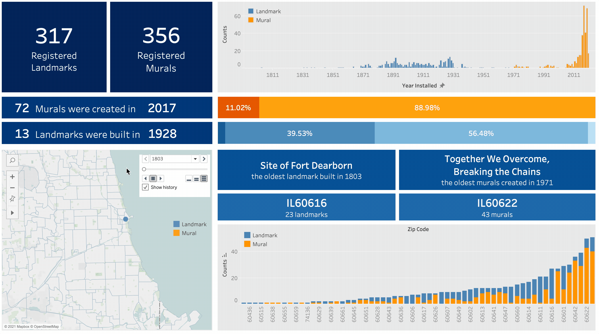
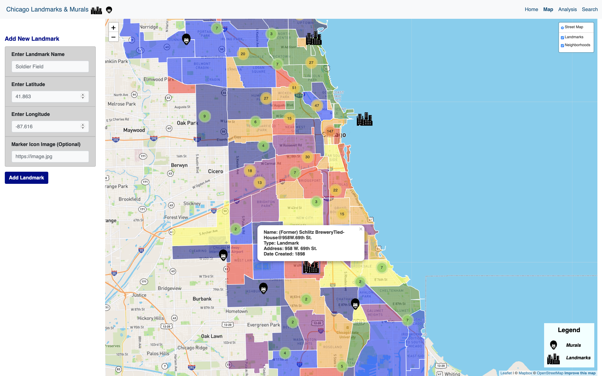
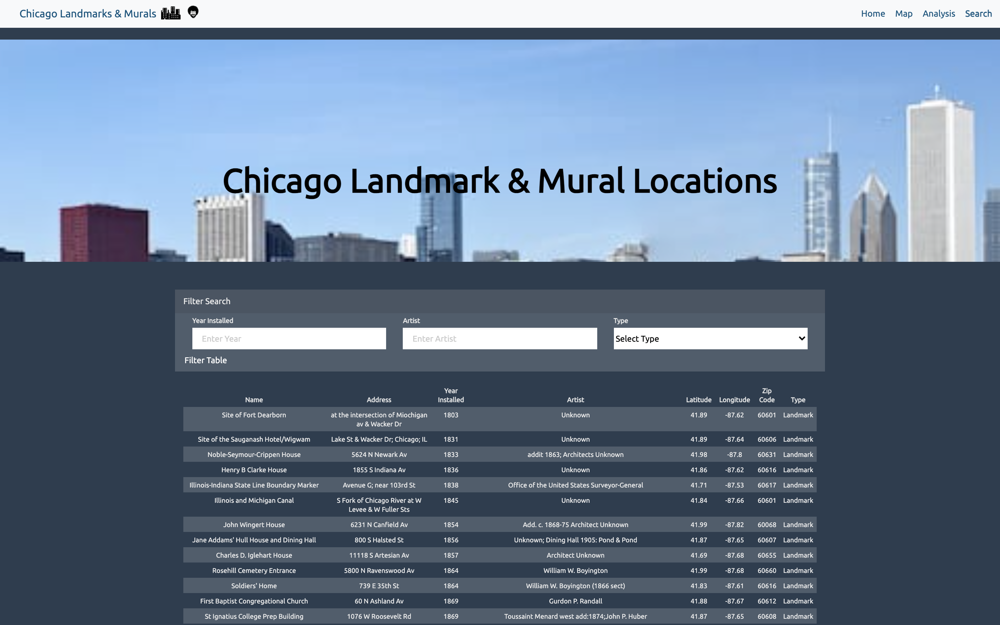
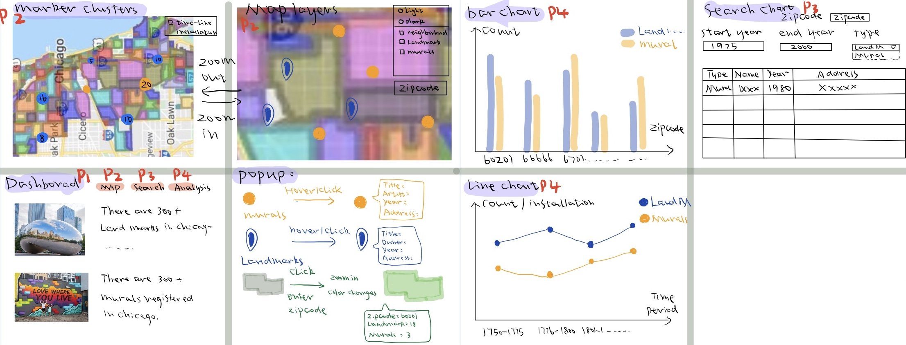
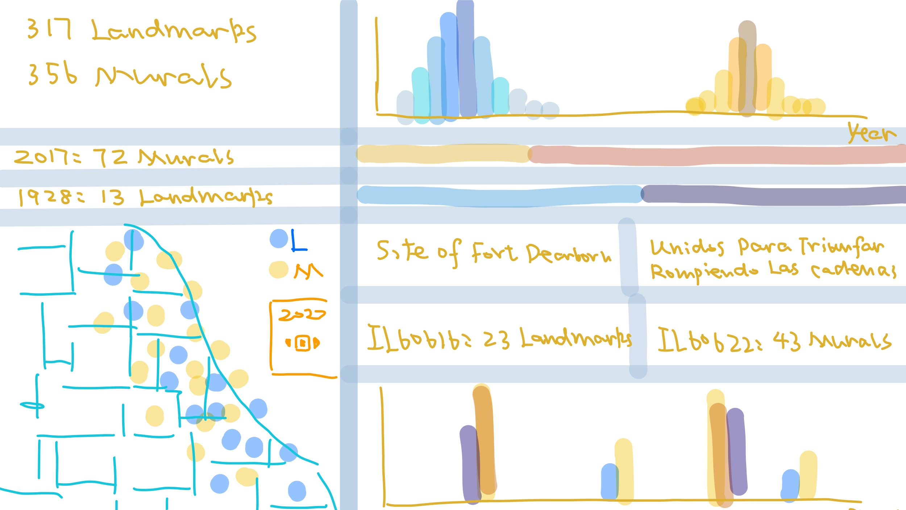

# Analysis of Chicago Murals and Landmarks

Webpage Running

Tableau Dashboard

[Landmarks and Murals in Chicago - Tableau Dashboard](https://public.tableau.com/profile/jiaping3168#!/vizhome/LandmarksandMuralsinChicago3/Dashboard)
## Project Description

The goal of the project is to analyze the installation and distributions of both murals and landmarks in Chicago to provide better tourism tools to explore Chicago, using interactive web pages and Tableau dashboard.  The `D3.js`, `Plotly.js` `Leaflet` libraries were used to allow interaction in addition to `HTML`, `CSS`, `Bootstrap`, and `Javascript`.

* Data Resources: [Chicago Data Portal - Individual Landmarks](https://data.cityofchicago.org/Historic-Preservation/Individual-Landmarks/tdab-kixi); 
[Chicago Data Portal - Mural Registry](https://data.cityofchicago.org/Historic-Preservation/Mural-Registry/we8h-apcf)
* All the project files are contained in this repo

### Sample Webpage Screenshot

 
 

### Design Sketch

## Instructions

### Steps

1. Download or clone all the files contained in this repo.
2. Create your  [Mapbox API Key](https://account.mapbox.com/auth/signup/)
3. Include `API-KEY`  in the `Visaulization/static/js/config.js`.
4. Run a python -m http.server or any other server for this purpose.
5. Load the `index.html` file inside `Visualization` folder.

## File Description

### 1. Visualization

* Contains the HTML code that drives the plots and references the required libraries
* The static folder contains 
  * the `css` folder with the formatting `CSS` information 
  * the `data` folder with the murals/landmarks data and boundary data used to make plot
  * the `html` folder with the other three map/analysis/chart `HTML` files.
  * the `js` folder with `js` files to drive webpages
  * the `image` folder with icons and background images

### 2. Rice

* Contains the `docx` file for data cleaning instruction
* Contains the `SQL` and `ipynb` files used for data cleaning 
* Contains the `ChicagoLandmarks2.csv` file with uncleaned data

### 3. Resources

* Contains the `CSV`, `js`, `geojson` files with raw data

### 4. imagess

* Contains the `gif`, `png`, `png` files showing the running webpage and our primary design sketch

Group Contributors:

[Jiaping Shen](https://github.com/choushuiguo325)

[Bryan Evans](https://github.com/bevansr)

[Laura Rice](https://github.com/LRiceBall)

[Carol Schiro](https://github.com/carolschiro)

[Daniel Karpowicz](https://github.com/DanielKarpowicz)

Ashley Kerber
